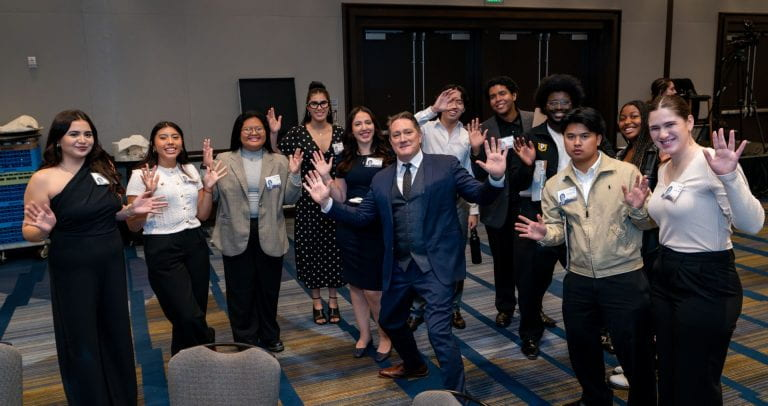

Here are various media that I have been featured in. Enjoy!

# University of San Francisco

## Seeing the Leo T. McCarthy Award's Impact

<!--  -->

{: .align-right width="300px"}

I had the opportunity to work as a Student Ambassador at the [2024 McCarthy Award for Public Service Event](https://usfblogs.usfca.edu/mccarthy/2025/02/14/seeing-the-leo-t-mccarthy-awards-impact/) [(Backup)](../files/mcCarthyAward.html).

---
Example: editing a Markdown file for a talk

---
## Hello!

<!--  -->
{: width="400px" style="float:right; padding-left:10px" }

I had the opportunity to work as a Student Ambassador at the [2024 McCarthy Award for Public Service Event](https://usfblogs.usfca.edu/mccarthy/2025/02/14/seeing-the-leo-t-mccarthy-awards-impact/) [(Backup)](../files/mcCarthyAward.html). Lorem ipsum. This is a description of a teaching experience. You can use markdown like any other post.This is a description of a teaching experience. You can use markdown like any other post. This is a description of a teaching experience. You can use markdown like any other post.This is a description of a teaching experience. You can use markdown like any other post. This is a description of a teaching experience. You can use markdown like any other post. This is a description of a teaching experience. You can use markdown like any other post. This is a description of a teaching experience. You can use markdown like any other post. This is a description of a teaching experience. You can use markdown like any other post.

